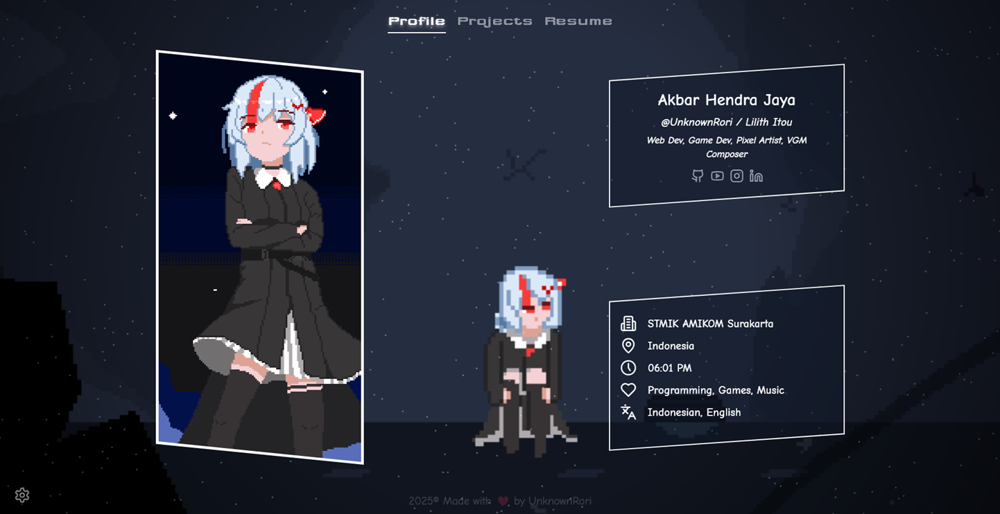

# unknownrori.vercel.app



<div align="center" style="margin: 0.85rem 0">
    <a href="https://github.com/UnknownRori/unknownrori.vercel.app/blob/main/LICENSE">
        
    </a>
    <a href="https://unknownrori.vercel.app">
        
    </a>
    <a href="https://github.com/UnknownRori/unknownrori.vercel.app">
        
    </a>
    <a href="https://wakatime.com/@UnknownRori">
        
    </a>
</div>

[unknownrori.vercel.app](https://unknownrori.vercel.app) is a minimal personalized online portfolio with 
built using Vue, before it was using Nuxt.js but this time I wanted to seperate frontend and backend 
for a bit for future development.

The origin of this project is to decommission my [portfolio project](https://unknownrori-firebase.web.app/) 
that was written in React.js, it's share some similarity on project structure.

## 🛠️ Development

### 📦 Requirements

- [pnpm](https://pnpm.io/) (recommended)
- [node.js](https://nodejs.org/en/) >= 20

```sh
# Clone the repo
git clone https://github.com/UnknownRori/unknownrori.vercel.app
cd unknownrori.vercel.app

# Install dependencies
pnpm install

# Start development server
pnpm run dev
```

## ⭐ Contribution

Feel free to contribute, I don't have any specific instruction.

## 📖 License

Source code is distributed under BSD 3-Clause License. See [LICENSE](./LICENSE) for more information
